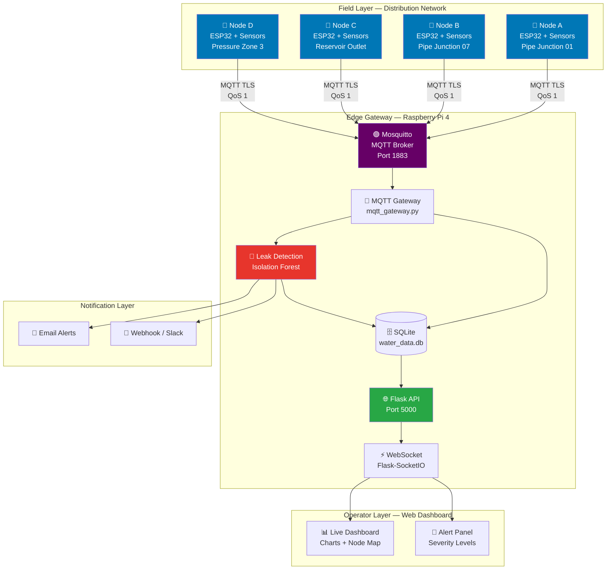
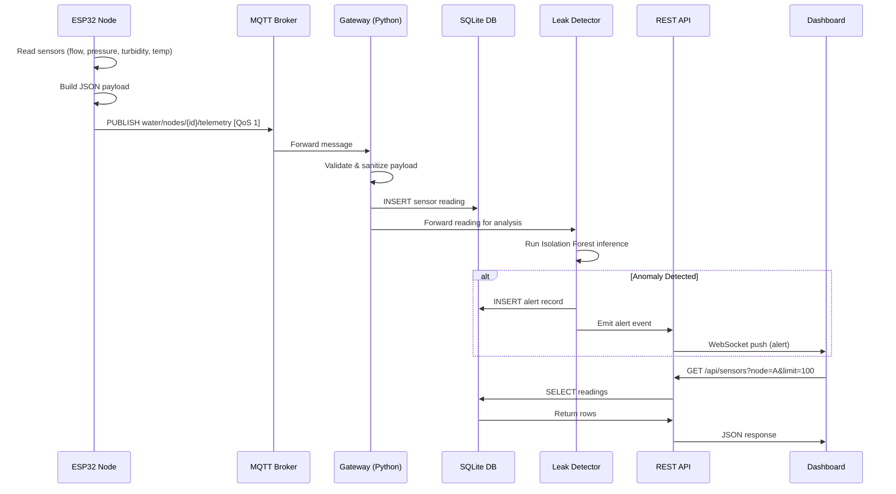
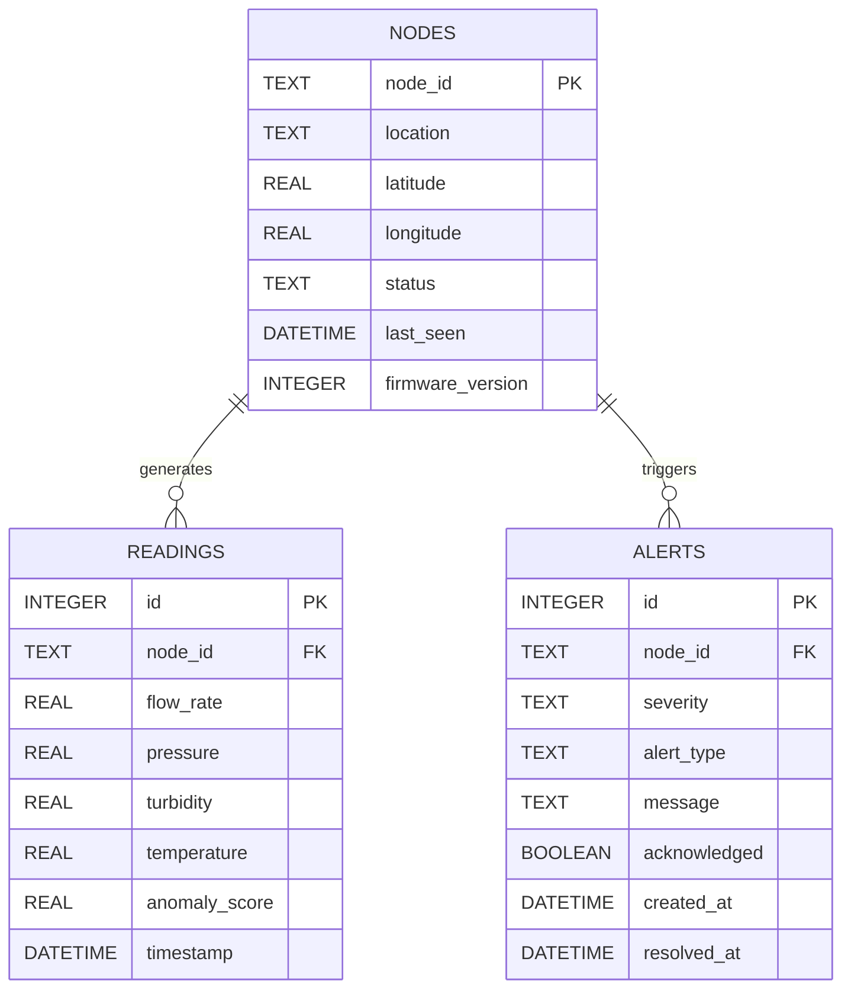

# 💧 Intelligent Urban Water Resource Management System

<div align="center">


[](https://www.python.org/)
[](https://www.espressif.com/)
[](https://mosquitto.org/)
[](https://flask.palletsprojects.com/)
[](https://scikit-learn.org/)
[](LICENSE)
[](https://www.raspberrypi.org/)
[]()

**A production-grade IoT system for real-time urban water network monitoring, AI-powered leak detection, and intelligent resource management.**

[Features](#-features) • [Architecture](#-system-architecture) • [Hardware](#-hardware-bill-of-materials) • [Installation](#-installation) • [API Reference](#-api--mqtt-specification) • [Roadmap](#-roadmap)

</div>

---

## 📋 Project Overview

This system provides a complete end-to-end solution for **smart urban water management**, combining edge IoT sensing with cloud-grade analytics. ESP32 microcontrollers deployed across the water distribution network continuously monitor flow rates, pressures, turbidity levels, and temperatures. Data is aggregated via an MQTT broker on a Raspberry Pi gateway, validated, persisted in SQLite, and fed into a machine learning pipeline based on **Isolation Forest** for real-time anomaly and leak detection.

A Flask-based REST API and WebSocket-enabled dashboard provide operators with live situational awareness, historical trends, and automatic alert notifications — enabling proactive infrastructure maintenance before costly failures occur.

> **Developer:** Anass Krim — Electrical Engineering & Industrial Management  
> **Institution:** École Nationale Supérieure des Arts et Métiers (ENSAM)  
> **Year:** 2025–2026

---

## ✨ Features

| # | Feature | Description |
|---|---------|-------------|
| 1 | **Multi-sensor IoT Nodes** | Each ESP32 node reads flow (YF-S201), pressure (MPX5700), turbidity (SEN0189), and temperature (DS18B20) simultaneously |
| 2 | **MQTT Telemetry** | Structured JSON payloads published over MQTT QoS 1 with automatic reconnection and offline buffering |
| 3 | **AI Leak Detection** | Isolation Forest anomaly detection with pressure wave correlation for leak localization within ±50 m |
| 4 | **Real-time Dashboard** | WebSocket-powered live graphs, node map, and alert panel accessible from any browser |
| 5 | **REST API** | Full CRUD API for sensor data, alerts, nodes, and historical queries with pagination |
| 6 | **Data Persistence** | SQLite database with automated daily backups and configurable retention policy |
| 7 | **Alert Escalation** | Three-tier severity system (INFO / WARNING / CRITICAL) with configurable thresholds and webhook notifications |
| 8 | **Deep Sleep Optimization** | ESP32 enters deep sleep between readings to extend battery life up to 18 months on 3000 mAh LiPo |
| 9 | **Watchdog Protection** | Hardware watchdog on ESP32 prevents firmware lockups; software watchdog on gateway ensures uptime |
| 10 | **Configuration-driven** | All thresholds, broker addresses, and AI parameters are externalized to `config/config.yml` — no code changes needed for deployment |
| 11 | **Data Validation** | Gateway validates and sanitizes all incoming payloads, rejecting malformed or out-of-range readings |
| 12 | **Model Retraining** | Automated weekly model retraining pipeline using accumulated historical data |

---

## 🏗️ System Architecture

### High-Level Overview



### Data Flow Diagram



### Database Schema



---

## 🔩 Hardware Bill of Materials

| # | Component | Model / Part | Qty | Unit Price (USD) | Unit Price (EUR) | Notes |
|---|-----------|-------------|-----|-----------------|-----------------|-------|
| 1 | Microcontroller | ESP32-WROOM-32D | 4 | $5.50 | €5.10 | Dual-core, 520 KB SRAM, Wi-Fi/BT |
| 2 | Flow Sensor | YF-S201 Hall Effect | 4 | $3.20 | €2.95 | 1–30 L/min, 2.0 MPa max |
| 3 | Pressure Sensor | MPX5700AP | 4 | $8.90 | €8.20 | 0–700 kPa, analog output |
| 4 | Turbidity Sensor | DFRobot SEN0189 | 4 | $9.50 | €8.75 | 0–3000 NTU, 5 V analog |
| 5 | Temperature Sensor | DS18B20 Waterproof | 4 | $2.80 | €2.60 | 1-Wire, -55 to +125 °C, IP67 |
| 6 | Gateway SBC | Raspberry Pi 4B (4 GB) | 1 | $55.00 | €50.70 | Gateway + AI inference host |
| 7 | LiPo Battery | 3.7 V 3000 mAh | 4 | $7.00 | €6.45 | Node power supply |
| 8 | Solar Charger | TP4056 + 6 V 1 W Panel | 4 | $5.50 | €5.07 | Outdoor node charging |
| 9 | 4.7 kΩ Resistor | DS18B20 pull-up | 4 | $0.05 | €0.05 | Pull-up for 1-Wire bus |
| 10 | Decoupling Capacitor | 100 nF ceramic | 16 | $0.03 | €0.03 | VCC decoupling per sensor |
| 11 | Waterproof Enclosure | IP67 ABS 120×80×55 mm | 4 | $6.00 | €5.53 | Field deployment housing |
| 12 | MicroSD Module | SPI MicroSD Adapter | 1 | $1.50 | €1.38 | Raspberry Pi storage |
| 13 | 32 GB MicroSD | Class 10 A1 | 1 | $6.00 | €5.53 | OS + database storage |
| 14 | 5 V 3 A USB-C PSU | RPi Official | 1 | $8.00 | €7.37 | Gateway power supply |
| | | | | **Total ≈ $174** | **Total ≈ €160** | Per 4-node deployment |

---

## 🧰 Software Stack

| Layer | Technology | Version | Purpose |
|-------|-----------|---------|---------|
| Firmware | Arduino / ESP-IDF (C++) | ESP32 Arduino 2.0.14 | Sensor reading, MQTT publishing |
| MQTT Broker | Eclipse Mosquitto | 2.0.18 | Message broker |
| Gateway | Python | 3.10+ | Data aggregation and validation |
| Database | SQLite | 3.42 | Local time-series storage |
| AI/ML | scikit-learn | 1.4.x | Isolation Forest anomaly detection |
| Numerics | NumPy | 1.26.x | Signal processing, pressure waves |
| API Framework | Flask + Flask-SocketIO | 2.3.x / 5.3.x | REST API and WebSocket server |
| MQTT Client (Python) | paho-mqtt | 1.6.x | Gateway MQTT subscription |
| Model Serialization | joblib | 1.3.x | Export/import trained models |
| Configuration | PyYAML | 6.0.x | config.yml parsing |
| HTTP Client | requests | 2.31.x | Webhook alert dispatch |
| Testing | pytest | 7.4.x | Unit and integration tests |

---

## 📁 Repository Structure

```
smart-urban-water-management/
├── README.md                        # This file
├── LICENSE                          # MIT License
├── requirements.txt                 # Python dependencies
├── .gitignore                       # Git ignore rules
│
├── src/
│   ├── sensors/
│   │   └── water_sensor_esp32.cpp   # ESP32 firmware (Arduino C++)
│   ├── gateway/
│   │   └── mqtt_gateway.py          # Raspberry Pi MQTT gateway
│   ├── ai/
│   │   └── leak_detection.py        # Isolation Forest leak detector
│   └── dashboard/
│       └── app.py                   # Flask dashboard backend
│
├── config/
│   ├── config.yml                   # Central configuration
│   └── mqtt_topics.md               # MQTT topic documentation
│
├── hardware/
│   ├── BOM.md                       # Bill of Materials
│   └── wiring_diagram.md            # Pin connection tables
│
├── docs/
│   ├── architecture.md              # System architecture deep-dive
│   ├── api_reference.md             # REST API documentation
│   └── installation.md             # Step-by-step setup guide
│
├── data/
│   └── sample_data.json             # 20+ realistic sensor readings
│
└── tests/
    └── test_leak_detection.py        # pytest unit tests
```

---

## 🚀 Installation

### Prerequisites
- Python 3.10 or higher
- Arduino IDE 2.x or PlatformIO with ESP32 board support
- Mosquitto MQTT broker
- Raspberry Pi 4B (or any Linux host)

### Quick Start (Gateway + AI)

```bash
# 1. Clone the repository
git clone https://github.com/anass-krim/smart-urban-water-management.git
cd smart-urban-water-management

# 2. Create and activate a virtual environment
python -m venv .venv
source .venv/bin/activate        # Linux/macOS
# .\.venv\Scripts\Activate.ps1  # Windows PowerShell

# 3. Install Python dependencies
pip install -r requirements.txt

# 4. Configure the system
cp config/config.yml config/config.local.yml
nano config/config.local.yml     # Edit broker IP, thresholds, etc.

# 5. Start Mosquitto broker
sudo systemctl start mosquitto

# 6. Launch the MQTT gateway
python src/gateway/mqtt_gateway.py --config config/config.local.yml

# 7. In a separate terminal, launch the dashboard API
python src/dashboard/app.py --config config/config.local.yml

# 8. Open your browser
# Navigate to http://<raspberry-pi-ip>:5000
```

### ESP32 Firmware Upload

```bash
# Using Arduino IDE:
# 1. Install ESP32 board package (Espressif Systems)
# 2. Install libraries: PubSubClient, ArduinoJson, DallasTemperature, OneWire
# 3. Open src/sensors/water_sensor_esp32.cpp
# 4. Edit WiFi SSID, password, and MQTT broker IP at the top of the file
# 5. Select Board: "ESP32 Dev Module", Port: your COM/ttyUSB port
# 6. Upload (Ctrl+U)

# Using PlatformIO:
pio run --target upload --environment esp32dev
```

---

## ⚙️ Configuration Guide

The central `config/config.yml` controls all system parameters:

```yaml
mqtt:
  broker_host: "192.168.1.100"  # IP of your Raspberry Pi / MQTT broker
  broker_port: 1883
  keepalive: 60

database:
  path: "data/water_data.db"

thresholds:
  flow_rate_min: 0.5    # L/min — below this triggers low-flow alert
  pressure_min: 100     # kPa   — below this triggers pressure-drop alert
  turbidity_max: 100    # NTU   — above this triggers contamination alert
  temperature_max: 35.0 # °C    — above this triggers thermal alert

ai_model:
  contamination: 0.05   # Expected fraction of anomalies (5%)
  retrain_interval_days: 7
```

See `config/config.yml` for the complete schema with all options documented.

---

## 📡 API / MQTT Specification

### MQTT Topics

| Topic Pattern | Direction | QoS | Description |
|--------------|-----------|-----|-------------|
| `water/nodes/{node_id}/telemetry` | Node → Broker | 1 | Sensor reading payload |
| `water/nodes/{node_id}/status` | Node → Broker | 1 | Node heartbeat & firmware info |
| `water/alerts/{node_id}` | Gateway → Broker | 2 | Leak/anomaly alert |
| `water/commands/{node_id}/sleep` | Gateway → Node | 1 | Remote sleep command |
| `water/commands/{node_id}/reboot` | Gateway → Node | 2 | Remote reboot command |

### REST API Endpoints

| Method | Endpoint | Description |
|--------|----------|-------------|
| GET | `/api/health` | System health check |
| GET | `/api/nodes` | List all registered nodes |
| GET | `/api/sensors` | Get sensor readings (supports `?node_id=`, `?limit=`, `?from=`, `?to=`) |
| GET | `/api/sensors/latest` | Latest reading per node |
| GET | `/api/alerts` | Get alerts (supports `?severity=`, `?acknowledged=false`) |
| POST | `/api/alerts/{id}/acknowledge` | Acknowledge an alert |
| GET | `/api/stats/daily` | Daily aggregated statistics |
| GET | `/api/model/status` | AI model metadata and last training timestamp |

### Sensor Data JSON Payload

```json
{
  "node_id": "node_A",
  "timestamp": "2025-10-14T08:32:15Z",
  "firmware": "1.3.2",
  "sensors": {
    "flow_rate":   12.47,
    "pressure":    312.5,
    "turbidity":   18.3,
    "temperature": 19.8
  },
  "system": {
    "battery_mv":  3821,
    "wifi_rssi":   -62,
    "uptime_s":    86400
  }
}
```

---

## 🗺️ Roadmap

### Phase 1 — Core MVP ✅ (Completed)
- [x] ESP32 multi-sensor firmware with MQTT publishing
- [x] Raspberry Pi MQTT gateway with SQLite storage
- [x] Isolation Forest leak detection engine
- [x] Flask REST API with WebSocket support
- [x] Configuration-driven deployment
- [x] Unit tests for AI module

### Phase 2 — Enhancement 🔄 (In Progress)
- [ ] LoRa/LoRaWAN support for areas without WiFi coverage
- [ ] TLS/SSL encryption for MQTT broker
- [ ] Grafana dashboard integration via InfluxDB adapter
- [ ] Multi-city deployment with centralized cloud aggregation
- [ ] Mobile application (Flutter) for field technicians
- [ ] OTA (Over-The-Air) firmware updates for ESP32

### Phase 3 — Advanced Analytics 📅 (Planned)
- [ ] LSTM time-series forecasting for consumption prediction
- [ ] Digital twin simulation of water network topology
- [ ] Integration with GIS maps (QGIS / Leaflet.js)
- [ ] Regulatory reporting export (PDF/CSV) for municipal authorities
- [ ] Water quality index (WQI) composite score computation
- [ ] Edge TPU acceleration for on-device AI inference

---

## 🧪 Running Tests

```bash
# Run all tests
pytest tests/ -v

# Run with coverage report
pytest tests/ -v --cov=src --cov-report=html

# Run a specific test
pytest tests/test_leak_detection.py::TestIsolationForestDetector -v
```

---

## 🤝 Contributing

Contributions are welcome! Please follow these steps:

1. Fork the repository
2. Create your feature branch: `git checkout -b feature/your-feature-name`
3. Write tests for your changes
4. Commit with a descriptive message: `git commit -m "feat: add LoRa support for remote nodes"`
5. Push to your branch: `git push origin feature/your-feature-name`
6. Open a Pull Request against `main`

Please adhere to [PEP 8](https://peps.python.org/pep-0008/) for Python code and use `clang-format` for C++ firmware code.

---

## 📄 License

This project is licensed under the **MIT License** — see the [LICENSE](LICENSE) file for details.

---

## 👤 Author

**Anass Krim**  
*Electrical Engineering & Industrial Management Student*

[](https://github.com/anass-krim)
[](https://linkedin.com/in/anass-krim)
[](mailto:anass.krim@etu.uae.ac.ma)

---

<div align="center">

**Topics:** `iot` `esp32` `mqtt` `raspberry-pi` `water-management` `smart-city` `anomaly-detection` `python` `arduino` `industry-4-0` `embedded-systems`

*Built with ❤️ for smarter, more resilient cities.*

</div>
